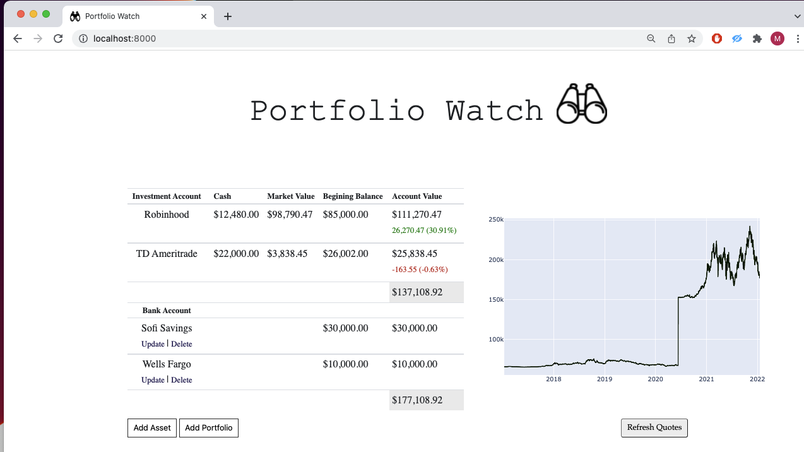

# Portfolio Watch
I could never find an app that conveniently consolidates all displays of my financial portfolios, so I created "Portfolio Watch" using Django and a few APIs to track multiple portfolios composed of equities, crypto, and options.

## Overview ##

Features a simple single-page layout to construct/track/backtest the performance of portfolios using current and historical price data. 


 


## Setup 
1. Install requirements (Recommend to use virtual env)
    ``` 
    pip install -r requirements.txt
    ```
2. Create new migration
    ``` 
    python manage.py makemigrations
    ```
3. Apply migrations
    ``` 
    python manage.py migrate
    ```

4. Obtain Free API key for AlphaVantage from __[RapidAPI](https://rapidapi.com/hub)__, write to  __secrets-example.json__, and rename file to __secrets.json__ 
__Please Note__: You must complete this step in order to refresh quotes!
    ``` 
    mv  secrets-example.json secrets.json
    ```

Execute ```python manage.py runserver ``` and navigate  to `http://localhost:8000/`
