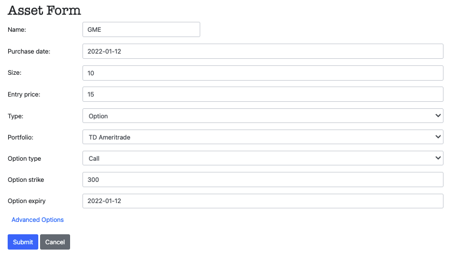

# Crypto Portfolio Tracker
Silly Coinbase Pro does not offer P&L tracking of active trades.. so I created this lightweight web app myself using Django and CoinGeko API.


Keep track of all your ongoing crypto trades, including tracking entry, target, stop loss and current coin price. Seamlessly integrated with CoinGeko API, so all the latest crypto coins on Coinbase are visible to track



## Setup 
1. Install requirements (Recommend to use virtual env)
    ``` 
    pip install -r requirements.txt
    ```
2. Create new migration
    ``` 
    python manage.py makemigrations
    ```
3. Apply migrations
    ``` 
    python manage.py migrate

4. Obtain Free API key for CoinGeko from __[RapidAPI](https://rapidapi.com/hub)__, write to  __secrets-example.json__, and rename file to __secrets.json__
    ``` 
    mv  secrets-example.json secrets.json
    ```
Execute ```python manage.py runserver ``` and navigate  to `http://localhost:8000/`
