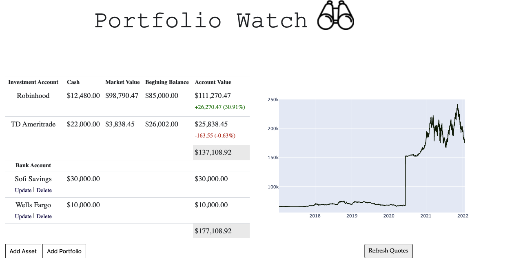
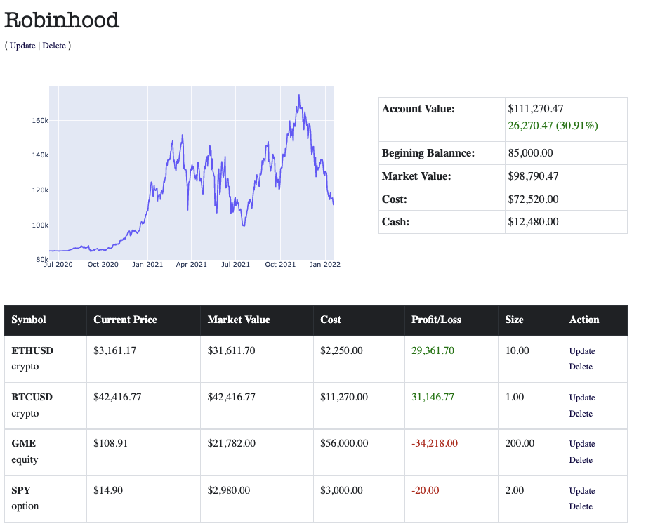
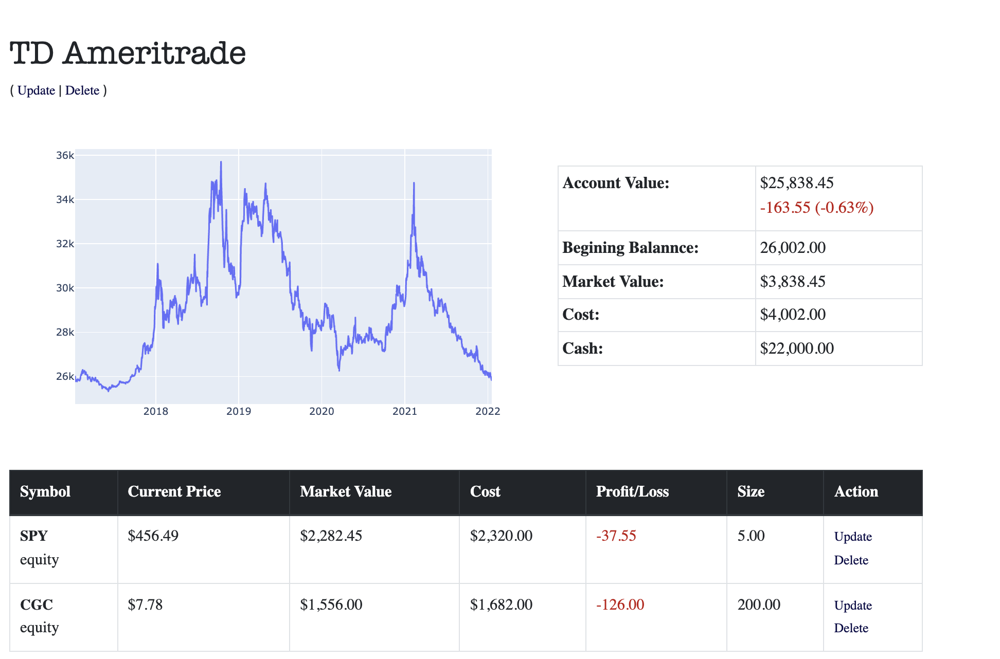
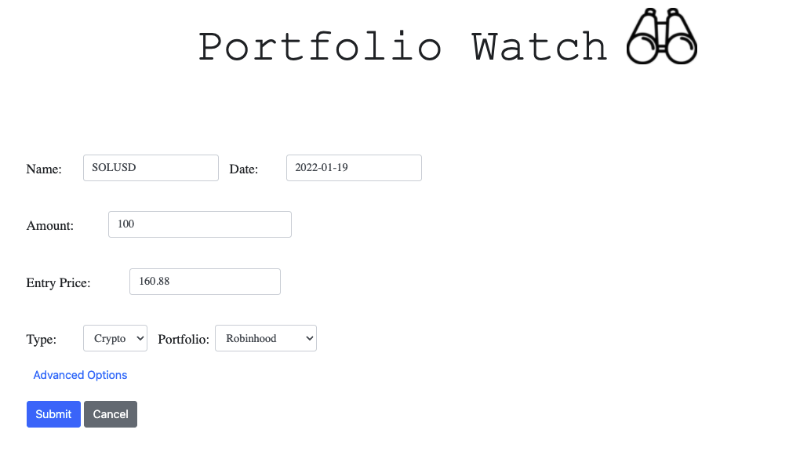
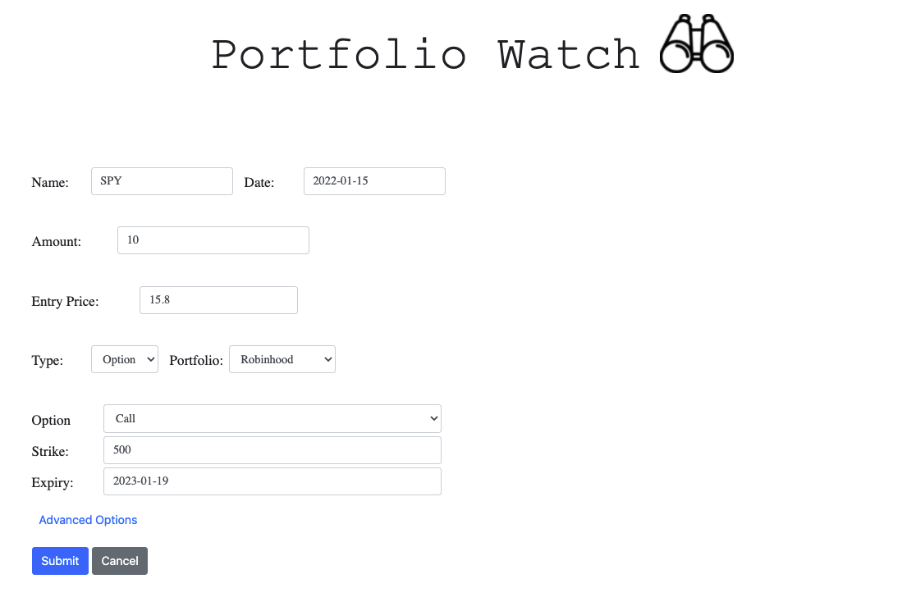
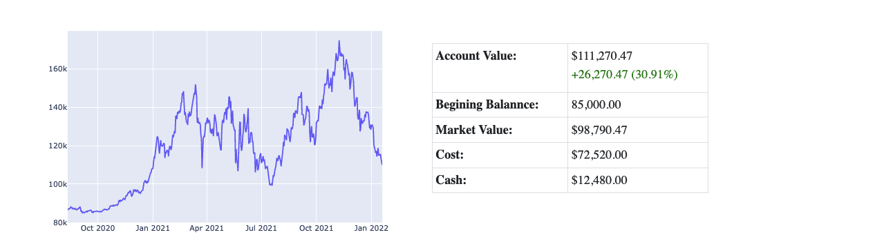

# Portfolio Watch
I could never find an app that conveniently consolidates all displays of my financial portfolios, so I created "Portfolio Watch" using Django and a few APIs to track multiple portfolios composed of equities, crypto, and options.

## Overview ##

Simple single-page layout to construct/track/backtest the performance of custom portfolios using current and historical price data. 


 




## Features ##

Add and track Crypto/Equity assets. Price and historical data is fetched using  __[Alpha Vantage](https://www.alphavantage.co/)__ API


Add and track Options. Price data is fetched using __[Yahoo_fin](https://theautomatic.net/yahoo_fin-documentation/)__ wrapper 



Visualize portfolio performance over historical timeframes.
Charted using __[Plotly](https://plotly.com/python/)__



## Setup 
1. Install requirements (Recommend to use virtual env)
    ``` 
    pip install -r requirements.txt
    ```
2. Create new migration
    ``` 
    python manage.py makemigrations
    ```
3. Apply migrations
    ``` 
    python manage.py migrate
    ```

4. Obtain Free API key for AlphaVantage from __[Alpha Vantage](https://www.alphavantage.co/)__, write to  __secrets-example.json__, and rename file to __secrets.json__. You must complete this step in order to refresh quotes!
    ``` 
    mv  secrets-example.json secrets.json
    ```

Execute ```python manage.py runserver ``` and navigate  to `http://localhost:8000/`
